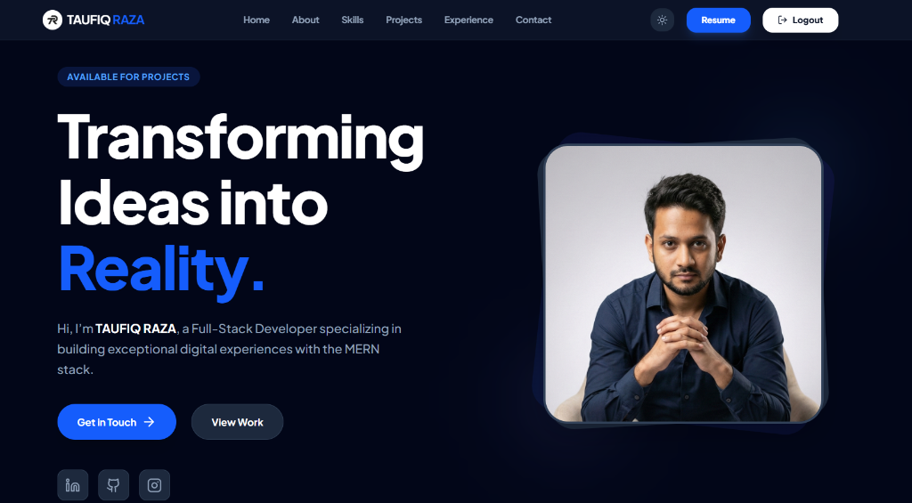
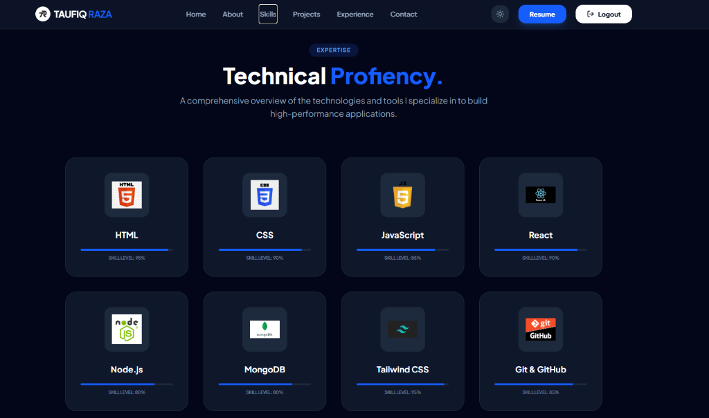

# 🌐 Personal Portfolio – MERN Stack

A modern, responsive **personal portfolio website** built using the **MERN Stack**, showcasing my skills, projects, and experience with secure authentication and a clean UI.

🔗 **Live Website:** https://your-portfolio.vercel.app  
🔗 **Backend API:** https://your-backend.onrender.com  

---

## 👀 Website Overview

This portfolio represents my professional profile and includes:

- Personal introduction & skills
- Project showcase
- Experience & resume
- Secure Login & Register system
- Fully responsive design (desktop & mobile)

Designed with a **clean layout**, smooth navigation, and real-world authentication flow.

---

## 🎞️ Animated Preview

> Quick walkthrough of the portfolio

---

## 📸 Website Snapshots

### 🏠 Home Page

### 🧠 Skills / About Section

### 📁 Projects Section

### 🔐 Login Page

### 📝 Register Page

### 📱 Mobile Navigation

---

## 🧱 Application Architecture

### Architecture Flow
- React handles UI & routing
- Express provides secure APIs
- JWT manages authentication
- MongoDB stores user data
- Tokens control protected access

---

## 🧠 Technology Stack

### Frontend

### Backend

---

## 🔐 Backend Overview

- JWT-based authentication
- Secure password hashing (bcrypt)
- Login & Register APIs
- Token verification middleware
- CORS-enabled REST API

---

## 👤 Author

**Taufiq Raza**  
- GitHub: https://github.com/TAUFIQ-RAZA  
- LinkedIn: https://linkedin.com/in/your-profile  

---

## ⭐ Final Note

This project demonstrates **real-world MERN stack development**, including authentication, responsive UI, clean architecture, and production deployment.

If you like this project, feel free to ⭐ the repository.
